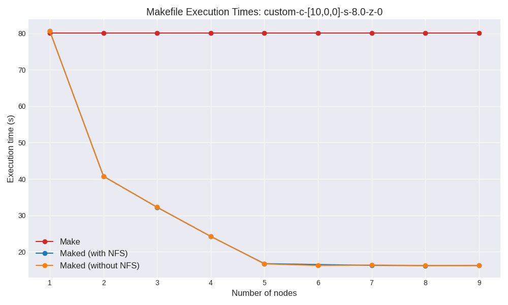

## Partie 1: Make local

Cette partie modélise le fonctionnement standard de `make`, qui repose sur la construction d'un arbre de dépendances et le déclenchement des tâches définies dans un Makefile.

La première étape de notre système `make` est la construction d’un graphe de dépendances. Ce graphe est représenté par une structure de données appelée `Graph`. Chaque noeud du graphe correspond à une cible (`target`) et contient :

* Une séquence de commandes à exécuter pour construire cette cible.  
* Une liste de dépendances (`dependencies`) indiquant les autres cibles qui doivent être construites avant cette cible.

Le parseur est conçu pour construire un graphe de dépendances à partir d’un fichier `Makefile`. Ce processus est modélisé par un automate à trois états.

1. **État 0** :  
   * Le parseur attend soit une nouvelle cible (`target`) soit la définition d'une variable.  
   * Une ligne correspondant à une cible entraîne une transition vers l’état 1. Si une variable est définie, l’état reste à 0.  
2. **État 1** :  
   * Le parseur attend soit une commande associée à la cible courante, soit une nouvelle cible.  
   * Une commande déclenche une transition vers l’état 2, tandis qu'une nouvelle cible maintient l’état à 1.  
3. **État 2** :  
   * Le parseur attend une commande supplémentaire pour la cible courante, une nouvelle cible, ou une définition de variable.  
   * Une commande reste à l’état 2, tandis qu'une nouvelle cible ramène à l’état 1. La définition d'une variable retourne à l’état 0.

Finalement, on construit une liste de commandes représentant les tâches à exécuter, en garantissant que toutes les dépendances ont été traitées au préalable. Cela est réalisé en parcourant le graphe de dépendances en profondeur (DFS) et en recueillant les différentes dépendances dans des structures `MakeElement`, associées à la commande initiale.

## Partie 2: Introduction de Golang go

Nous avons décidé d’utiliser **Go RPC** pour notre projet. Le **Remote Procedure Call (RPC)** permet d’établir une communication entre processus situés sur des machines différentes, comme si les fonctions distantes étaient appelées localement.

### **Fonctionnement du RPC à Haut Niveau**

Pour expliquer brièvement le fonctionnement du RPC, voici les étapes principales :

1. **Sérialisation des Données** : Les messages échangés entre le client et le serveur sont d'abord convertis en un format sérialisé pour faciliter leur transmission sur le réseau.  
2. **Transmission via la Couche de Transport** : Une fois sérialisées, les données sont transmises sur la couche de transport réseau, généralement TCP.  
3. **Désérialisation** : À la réception, les données sont désérialisées pour être interprétées et utilisées par le destinataire.

### **Pourquoi Gob comme méthode d’Encodage ?**

Go RPC se distingue par l’utilisation de **Gob** pour la sérialisation des données, une méthode optimisée et spécifique à l’écosystème Go. Contrairement à d’autres formats d’encodage standards comme JSON ou XML, Gob encode les données dans un format binaire compact, conçu pour être performant et bien intégré au système de types de Go.

Gob est spécifiquement conçu pour Go, garantissant une parfaite compatibilité entre les structures de données de Go.

## Partie 3: Algorithm distribuée

### **1. Description générale de l'architecture**

* Notre architecture est basée sur un modèle **Master-Worker**, où le serveur (Master) coordonne les tâches, et les clients (Workers) exécutent les instructions reçues.  
* Ce modèle est adapté pour les scénarios où les tâches doivent être divisées et exécutées de manière distribuée, en maximisant l'efficacité et la parallélisation.

---

### **2. Rôle du serveur (Master)**

* Le **Master** est responsable de gérer l'état des instructions grâce à trois listes :  
  * **InstructionsToDo** : Contient les tâches à exécuter.  
  * **InstructionsInProgress** : Contient les tâches en cours d'exécution.  
  * **InstructionsDone** : Contient les tâches terminées.  
* Le serveur utilise des mécanismes de synchronisation (`sync.Mutex`) pour assurer une gestion sécurisée des données partagées dans un environnement concurrent.

---

### **3. Rôle des clients (Workers)**

* Ils communiquent avec le serveur via des appels RPC pour récupérer initialement les fichiers make, pour récupérer des instructions, et finalement renvoyer les résultats de ces instructions.

---

### 4. Comment ca marches?

 

### **5. Les fonctions RPC implémentées**

#### **a. `Initialization`**

* Appelée par un client pour récupérer les fichiers Make nécessaires.  
* Le serveur parcourt son répertoire, lit les fichiers et les envoie au client.  
* Cela assure que le client dispose de toutes les dépendances nécessaires à l'exécution des instructions.

#### **b. `Ping`**

* Utilisée pour attribuer des tâches aux clients.  
* Le serveur vérifie si toutes les dépendances d'une instruction sont satisfaites (présentes dans `InstructionsDone`).  
* Si oui, il envoie l'instruction au client. Sinon, il attend que les dépendances soient complétées.  
* Réponse possible :  
  * `Value = 2` : Une instruction est prête à être exécutée.  
  * `Value = 1` : Aucune tâche ne peut être exécutée pour le moment.  
  * `Value = 0` : Plus aucune tâche disponible.

#### **c. `SendFile`**

* Appelée par un client pour renvoyer le résultat de l'exécution d'une tâche.

### **Mesure de performance sur grid5000 Pingpong normal**

  

  **Evolution de la Latence relativement à la taille du message sur Grid5000 Grenoble**

  

  **Evolution du débit relativement à la taille du message sur Grid5000 Grenoble**

  

  **Tableau représentant la Latence pour un message de taille minimal et le débit pour un message de taille 4 GB sur grid5000**

### **Mesure de performance sur grid5000 Pingpong avec I/O**

  

  **Evolution de la Latence relativement à la taille du fichier lit et envoyé sur Grid5000 Grenoble**

  

  **Evolution du débit relativement à la taille du fichier lit et envoyé sur Grid5000 Grenoble**

  

**Tableau représentant la Latence pour un message de taille minimal et le débit pour un message de taille 4 GB sur grid5000**

## Partie 4: Résultats final, avec et sans NFS

La première approche de notre projet consiste à utiliser kdeploy dans l’environnement Grid5000 sans dépendre d’un système de fichiers partagé tel que NFS. Cette stratégie a été choisie principalement pour des raisons organisationnelles, notamment afin de mieux isoler les fichiers de sortie générés sur chaque nœud.

Cependant, en consultant la documentation, nous avons découvert qu’il est également possible d’utiliser NFS tout en conservant des répertoires locaux propres à chaque nœud, notamment en exploitant les répertoires temporaires comme /tmp.

Ainsi, nous avons identifié et testé deux approches distinctes :

    Sans NFS : où les fichiers sont gérés indépendamment sur chaque nœud.
    Avec NFS : tout en utilisant des répertoires locaux spécifiques à chaque nœud pour isoler les données.

Ces deux configurations seront comparées en termes de performances et d’efficacité organisationnelle.

### Résultats premier_tiny

Nous remarquons que la version avec NFS est nettement plus efficace que celle sans NFS. Ceci s'explique car premier_tiny génère peu de fichiers.

### Résultats matrix

Ici, l'ordre s'inverse, et c'est maintenant la version sans NFS qui est la plus rapide, même si l'avantage par rapport au make est faible. Ceci s'explique par le nombre d'appels réseau qui ont lieu dans ce genre de makefile (avec de nombreuses petites commandes).

### Résultats custom-c-[10,0,0]-s-8.0-z-0

Ici, l'ordre s'inverse, et c'est maintenant la version sans NFS qui est la plus rapide, même si l'avantage par rapport au make est faible. Ceci s'explique par le nombre d'appels réseau qui ont lieu dans ce genre de makefile (avec de nombreuses petites commandes).

### Résultats custom-c-[10,10,10]-s-0.0-z-10000

Ici, l'ordre s'inverse, et c'est maintenant la version sans NFS qui est la plus rapide, même si l'avantage par rapport au make est faible. Ceci s'explique par le nombre d'appels réseau qui ont lieu dans ce genre de makefile (avec de nombreuses petites commandes).
